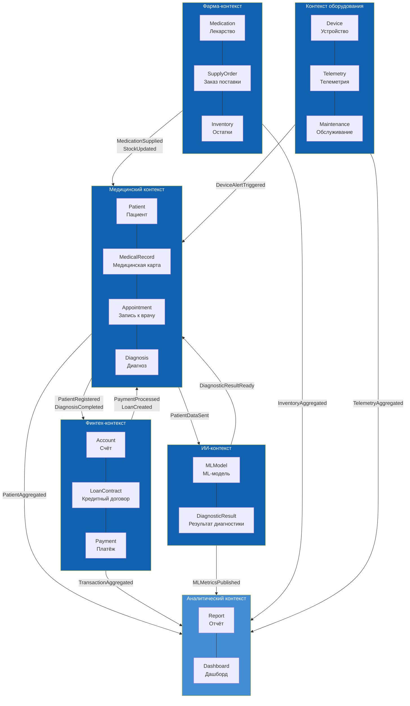

# Bounded Contexts — «Будущее 2.0»

Разделение системы на ограниченные контексты по DDD. Каждый контекст — независимый домен с собственным языком, данными и Data Product.

## Карта контекстов

| Bounded Context | Владелец домена | Data Product | Ключевые агрегаты |
|---|---|---|---|
| **Медицинский** | Медицина | `Patient360` | Patient, MedicalRecord, Appointment, Diagnosis |
| **Финтех** | Банк | `FinancialCore` | Account, LoanContract, Payment |
| **ИИ** | AI-сервисы | `AIDiagnostics` | MLModel, DiagnosticResult |
| **Фарма** | Фарма-компании | `PharmaInventory` | Medication, SupplyOrder, Inventory |
| **Оборудование** | Производитель | `DeviceTelemetry` | Device, Telemetry, Maintenance |
| **Аналитика** | BI-команда | `AnalyticsHub` | Report, Dashboard |

## Типы связей между контекстами

| Тип связи | Паттерн | Пример |
|---|---|---|
| **ACL (Anti-Corruption Layer)** | Изоляция легаси-форматов | Медицинский контекст ↔ DWH через Legacy Bridge |
| **Партнёрство (Partnership)** | Двусторонняя интеграция через события | Медицинский ↔ Финтех (согласованные контракты событий) |
| **Customer/Supplier** | Один поставляет данные, другой потребляет | ИИ-контекст → Медицинский (результаты диагностики) |
| **Conformist** | Потребитель принимает модель поставщика «как есть» | Аналитика ← все домены (агрегированные события) |
| **Shared Kernel** | Общая модель для ограниченного набора | PatientID, AccountID — глобальные идентификаторы |

## Принципы взаимодействия

1. **События как primary integration** — домены не вызывают друг друга синхронно. Все значимые факты публикуются в Event Bus.
2. **Schema Registry** — все события проходят валидацию схемы (Avro). Контракты версионируются.
3. **Global IDs** — сквозные идентификаторы (`patient_id`, `account_id`), единый формат UUID.
4. **Data Product Ownership** — каждый контекст владеет своим Data Product и отвечает за его качество и SLA.
